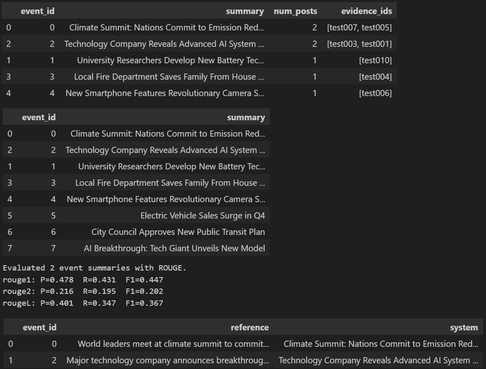

# IRIS: Reddit Event Detection & Summarization
[](https://www.python.org/downloads/)
[](https://scikit-learn.org/)

End-to-end natural language processing pipeline that collects public Reddit posts, clusters them into events, and generates short extractive summaries per event.
The codebase is organized as a reusable Python package under `src/` and includes notebooks that mirror the pipeline stages.

## Table of Contents

- [Highlights](#highlights)
- [Quickstart (Windows / PowerShell)](#quickstart-windows--powershell)
- [Configuration](#configuration)
- [Usage](#usage)
- [Evaluation (ROUGE)](#evaluation-rouge)
- [Notebooks](#notebooks)
- [Outputs](#outputs)
- [Project Structure](#project-structure)
- [Troubleshooting](#troubleshooting)
- [Future Work](#future-work)
- [Author](#author)

---

## Demo



---

## Highlights

<details>
<summary><b>Expand</b></summary>

- Data ingestion via the Reddit API (`praw`), persisted as JSONL
- Text preprocessing and TF–IDF feature extraction
- Unsupervised event discovery via agglomerative clustering (cosine distance)
- Centroid-based extractive summarization with evidence post IDs
- ROUGE evaluation against a small human-written reference set
- Clear module boundaries: `collect`, `preprocess`, `events`, `summarize`, `evaluate`, `pipeline`

</details>

---

## Quickstart (Windows / PowerShell)

From the repo root:

```powershell
python -m venv .venv
.\.venv\Scripts\Activate.ps1

pip install -r requirements.txt

python -c "import nltk; nltk.download('stopwords')"

$env:PYTHONPATH = "src"
python -m iris_reddit_events.pipeline
```

---

## Configuration

<details>
<summary><b>Expand</b></summary>

### Reddit credentials

To collect live Reddit data, create a `.env` file in the repo root:

```env
REDDIT_CLIENT_ID=your_client_id_here
REDDIT_CLIENT_SECRET=your_client_secret_here
REDDIT_USER_AGENT=iris-reddit-events (by u/your_username)
```

Credentials are loaded in `src/iris_reddit_events/config.py`.

</details>

---

## Usage

<details>
<summary><b>Expand</b></summary>

All commands below assume `PYTHONPATH=src`.

### 1) Collect data

```powershell
$env:PYTHONPATH = "src"
python -m iris_reddit_events.collect
```

This writes a timestamped JSONL file under `data/raw/`.

### 2) Run preprocessing -> clustering -> summarization

```powershell
$env:PYTHONPATH = "src"
python -m iris_reddit_events.pipeline
```

Defaults:
- Subreddits: `news`, `worldnews`, `technology`
- Clustering: `distance_threshold=0.8`
- Summaries: `top_k=3` titles

Tune parameters in `src/iris_reddit_events/pipeline.py`.

</details>

---

## Evaluation (ROUGE)

<details>
<summary><b>Expand</b></summary>

1) Create `data/gold_summaries.csv` with:

```csv
event_id,reference
0,"<your human-written summary for event 0>"
3,"..."
```

2) Run evaluation:

```powershell
$env:PYTHONPATH = "src"
python -m iris_reddit_events.evaluate --gold data/gold_summaries.csv
```

</details>

---

## Notebooks

<details>
<summary><b>Expand</b></summary>

Notebooks mirror the pipeline stages:

- `notebooks/00_check_config.ipynb`: confirms paths + `.env` loading
- `notebooks/01_preprocess.ipynb`: loads raw JSONL, builds TF–IDF
- `notebooks/02_events.ipynb`: clusters posts into `event_id`
- `notebooks/03_summarize.ipynb`: generates summaries from labeled events
- `notebooks/04_eval.ipynb`: runs ROUGE against a gold CSV

</details>

---

## Outputs

- `data/raw/reddit_*.jsonl`: raw collection results
- `data/processed/posts.parquet`: cleaned post table
- `data/events/events_labeled.parquet`: post table + `event_id`
- `data/summaries/summaries.parquet`: event-level summaries (+ evidence post IDs)

---

## Project Structure

```text
src/iris_reddit_events/
    collect.py     # Reddit API ingestion
    preprocess.py  # text cleaning + TF–IDF
    events.py      # clustering into events
    summarize.py   # centroid-based extractive summaries
    evaluate.py    # ROUGE evaluation helpers + CLI
    pipeline.py    # end-to-end runner
    config.py      # paths + .env loading
notebooks/       # exploratory / report notebooks
```

---

## Troubleshooting

<details>
<summary><b>Expand</b></summary>

- Parquet read/write error: install an engine (recommended): `pip install pyarrow`
- `LookupError: Resource stopwords not found`: run `python -c "import nltk; nltk.download('stopwords')"`
- `No raw files found`: run the collector so `data/raw/reddit_*.jsonl` exists
- Import errors in scripts: ensure `PYTHONPATH=src` is set

</details>

---

## Future Work

<details>
<summary><b>Expand</b></summary>

- Replace TF–IDF with dense embeddings for improved clustering
- Move to sentence-level extraction to reduce redundancy
- Add time-aware segmentation (windowing / burst detection)

</details>

---

## Author

Symaedchit Octavius Leo

Built for CSE 482 (Big Data Analysis).

#### Data Collection
```powershell
python -m iris_reddit_events.collect
```
Fetches recent posts from configured subreddits and saves to `data/raw/`.

**Configuration** (in `collect.py`):
- Subreddits: `news`, `worldnews`, `technology`
- Posts per subreddit: 300 (configurable via `limit` parameter)

#### Preprocessing Only
```python
from iris_reddit_events import preprocess as pp

df = pp.load_raw()
X, vectorizer, df_clean = pp.vectorize(df)
```

#### Event Clustering Only
```python
from iris_reddit_events import events

df_events = events.cluster_events(
    X, 
    df_clean, 
    n_clusters=None, 
    distance_threshold=0.8
)
```

#### Summarization Only
```python
from iris_reddit_events import summarize

df_summaries = summarize.summarize_events(df_events, top_k=3)
```

</details>

### Interactive Notebooks

<details>
<summary><b>Click to view notebook descriptions</b></summary>

The `notebooks/` directory contains Jupyter notebooks that mirror each pipeline stage:

| Notebook | Purpose | Key Outputs |
|----------|---------|-------------|
| `00_check_config.ipynb` | Verify environment setup | Confirms paths and `.env` loading |
| `01_preprocess.ipynb` | Data preprocessing | TF-IDF matrix, cleaned DataFrame |
| `02_events.ipynb` | Event clustering | Event assignments per post |
| `03_summarize.ipynb` | Summary generation | Event summaries with evidence IDs |
| `04_eval.ipynb` | ROUGE evaluation | Precision, recall, F1 scores |

**Running Notebooks:**
1. Launch Jupyter: `jupyter notebook`
2. Navigate to `notebooks/` directory
3. Open desired notebook
4. Run cells sequentially

**Note:** Notebooks automatically configure the Python path to import the `iris_reddit_events` package.

</details>

---

## Project Structure

<details>
<summary><b>Click to view complete project structure</b></summary>

```
cse482-reddit-events/
├── src/
│   └── iris_reddit_events/
│       ├── __init__.py
│       ├── collect.py          # Reddit API data collection
│       ├── config.py            # Configuration and paths
│       ├── preprocess.py        # Text preprocessing & TF-IDF
│       ├── events.py            # Event clustering logic
│       ├── summarize.py         # Summary generation
│       ├── evaluate.py          # ROUGE evaluation + CLI
│       └── pipeline.py          # End-to-end orchestration
│
├── notebooks/
│   ├── 00_check_config.ipynb   # Environment verification
│   ├── 01_preprocess.ipynb     # Preprocessing exploration
│   ├── 02_events.ipynb         # Clustering analysis
│   ├── 03_summarize.ipynb      # Summary generation
│   └── 04_eval.ipynb           # Evaluation workflow
│
├── data/
│   ├── raw/                    # Raw Reddit JSONL files
│   ├── processed/              # Preprocessed Parquet files
│   ├── events/                 # Event-labeled data
│   ├── summaries/              # Generated summaries
│   └── gold_summaries.csv      # Human reference summaries
│
├── requirements.txt            # Python dependencies
├── .env                        # Environment variables (gitignored)
├── .gitignore
└── README.md
```

### Key Files

- **`config.py`**: Centralized configuration (paths, environment variables)
- **`pipeline.py`**: Main entry point for full pipeline execution
- **`evaluate.py`**: Can be run as CLI tool or imported as module
- **`requirements.txt`**: Pinned dependencies for reproducibility

</details>

---

## Configuration

<details>
<summary><b>Click to view configuration options</b></summary>

### Environment Variables (`.env`)

```env
REDDIT_CLIENT_ID=your_client_id
REDDIT_CLIENT_SECRET=your_secret_key
REDDIT_USER_AGENT=iris-reddit-events (by u/username)
```

### Pipeline Parameters

**Clustering** (`events.py`):
```python
cluster_events(
    X,                          # TF-IDF matrix
    df_posts,                   # Posts DataFrame
    n_clusters=None,            # Auto-determine via threshold
    distance_threshold=0.8      # Cosine distance cutoff
)
```

**Summarization** (`summarize.py`):
```python
summarize_events(
    df_events,                  # Event-labeled posts
    top_k=3                     # Number of representative posts
)
```

**Data Collection** (`collect.py`):
```python
collect_sample(
    subreddits=("news", "worldnews", "technology"),
    limit=300                   # Posts per subreddit
)
```

### Modifying Defaults

Edit `src/iris_reddit_events/pipeline.py` to change default parameters:

```python
def main():
    # Adjust these values
    df_events = events.cluster_events(
        X, df_clean, 
        distance_threshold=0.7   # More granular events
    )
    
    df_sum = summarize.summarize_events(
        df_events, 
        top_k=5                   # Longer summaries
    )
```

</details>

---

## Evaluation

<details>
<summary><b>Click to view evaluation methodology</b></summary>

### ROUGE Metrics

The system uses ROUGE (Recall-Oriented Understudy for Gisting Evaluation) to compare generated summaries against human references.

**Metrics Computed:**
- **ROUGE-1**: Unigram overlap
- **ROUGE-2**: Bigram overlap
- **ROUGE-L**: Longest common subsequence

### Creating Reference Summaries

1. Generate system summaries first:
   ```powershell
   python -m iris_reddit_events.pipeline
   ```

2. Create `data/gold_summaries.csv`:
   ```csv
   event_id,reference
   0,"Human-written summary for event 0"
   2,"Human-written summary for event 2"
   5,"Human-written summary for event 5"
   ```

3. Run evaluation:
   ```powershell
   python -m iris_reddit_events.evaluate --gold data/gold_summaries.csv
   ```

### Example Output

```
Evaluated 3 event summaries with ROUGE.
rouge1: P=0.478  R=0.431  F1=0.447
rouge2: P=0.216  R=0.195  F1=0.202
rougeL: P=0.401  R=0.347  F1=0.367
```

**Interpretation:**
- **Precision (P)**: How much of the generated summary is relevant
- **Recall (R)**: How much of the reference is captured
- **F1**: Harmonic mean of precision and recall

</details>

---

## Troubleshooting

<details>
<summary><b>Click to view common issues and solutions</b></summary>

### Issue: ModuleNotFoundError: No module named 'iris_reddit_events'

**Solution:**
```powershell
$env:PYTHONPATH = "src"
```
Ensure set this in every new terminal session, or add to shell profile.

---

### Issue: LookupError: Resource stopwords not found

**Solution:**
```powershell
python -c "import nltk; nltk.download('stopwords')"
```

---

### Issue: ImportError: Unable to find a usable engine for parquet

**Solution:**
```powershell
pip install pyarrow
```
This should already be in `requirements.txt`, but reinstall if needed.

---

### Issue: TypeError: AgglomerativeClustering() got unexpected keyword 'affinity'

**Cause:** scikit-learn API change in version 1.4+

**Solution:** Already fixed in `events.py` (uses `metric=` instead of `affinity=`)

---

### Issue: No raw files found in data/raw/

**Solution:** The project includes sample data. If missing create test data or run the collector:
```powershell
python -m iris_reddit_events.collect
```

---

### Issue: praw.exceptions.ResponseException: received 401 HTTP response

**Cause:** Invalid Reddit API credentials

**Solution:**
1. Verify credentials in `.env` file
2. Ensure no extra spaces or quotes
3. Regenerate credentials at https://www.reddit.com/prefs/apps

---

### Issue: Notebook cells fail with import errors

**Solution:** Notebooks include path setup cells. Run them first:
```python
import sys
from pathlib import Path
sys.path.insert(0, str(Path.cwd().parent / "src"))
```

</details>

---

## Future Enhancements

<details>
<summary><b>Click to view planned improvements</b></summary>

### Short-Term Goals
- [ ] Replace TF-IDF with dense embeddings (sentence-transformers, BERT)
- [ ] Implement sentence-level extraction using TextRank
- [ ] Add temporal segmentation for time-aware event detection
- [ ] Create web dashboard for real-time monitoring
- [ ] Add support for multiple languages

### Medium-Term Goals
- [ ] Implement abstractive summarization with fine-tuned T5/BART
- [ ] Add named entity recognition for key figure extraction
- [ ] Implement topic modeling (LDA) alongside clustering
- [ ] Create REST API for programmatic access
- [ ] Add Docker containerization

### Long-Term Vision
- [ ] Real-time streaming pipeline with Apache Kafka
- [ ] Multi-source integration (Twitter, news sites, forums)
- [ ] Fact-checking integration with claim verification
- [ ] Personalized event filtering based on user interests
- [ ] Mobile application for summary consumption

</details>

---

## Sample Data

The repository includes sample Reddit data in `data/raw/reddit_20260101_120000.jsonl` for immediate testing. This contains 10 synthetic posts across three topics:
- AI technology announcements
- Climate summit news
- Local news events

To collect live Reddit data, configure API credentials and run the collector.

---

## License

This project is licensed under the MIT License. See LICENSE file for details.

---

## Author

**Symaedchit Octavius Leo**

*Built as part of CSE 482: Big Data Analysis*

---

## Acknowledgments

- Reddit API via [praw](https://praw.readthedocs.io/)
- scikit-learn for machine learning tools
- NLTK for natural language processing
- Google's ROUGE implementation for evaluation

---
